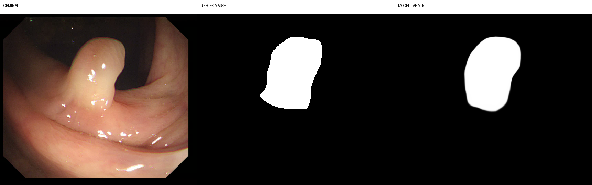

# PraNet-V2 Polyp Segmentation

A deep learning-based binary polyp segmentation project using **PraNet-V2** for medical image segmentation.

## Overview

This repository contains a binary polyp segmentation pipeline for colonoscopy images based on PraNet-V2.

The project provides:

- PraNet-V2-based polyp segmentation
- Training and inference scripts
- GPU-accelerated inference with PyTorch
- Quantitative evaluation
- Evaluation on four benchmark datasets
- CSV-based evaluation results
- Example segmentation visualization

## Datasets

The evaluation pipeline was tested on the following benchmark datasets:

- **CVC-300**
- **CVC-ClinicDB**
- **Kvasir**
- **ETIS-LaribPolypDB**

The dataset files are not included in this repository because of their size.

## Project Structure

```text
PraNet-V2-Polyp-Segmentation/
│
├── MyTrain_med.py
├── MyTest_med.py
├── MyTest_med_backup.py
├── eval.py
├── README.md
├── .gitignore
│
├── comparison_149.png
│
├── eval_results/
│   └── PraNet-V2/
│       ├── result_CVC-300.csv
│       ├── result_CVC-ClinicDB.csv
│       ├── result_Kvasir.csv
│       └── result_ETIS-LaribPolypDB.csv
│
├── lib/
│   ├── PraNet_Res2Net.py
│   ├── PraNet_ResNet.py
│   ├── Res2Net_v1b.py
│   ├── ResNet.py
│   └── ...
│
├── utils/
│   ├── dataloader.py
│   ├── eval_functions.py
│   ├── format_conversion.py
│   └── utils.py
│
└── jittor/
    ├── MyTest.py
    ├── eval.py
    └── ...
```

## Installation

Create a Python virtual environment:

```bash
python -m venv .venv
```

Activate the environment on Windows:

```powershell
.venv\Scripts\activate
```

Install the required dependencies:

```bash
pip install -r requirements.txt
```

> Note: `requirements.txt` should be created separately if it is not already present in the repository.

## Pretrained Model

The pretrained PraNet-V2 model weights are not included in this repository because of their file size.

The expected location of the checkpoint is:

```text
snapshots/
└── PraNet-V2/
    └── RES-V2.pth
```

The checkpoint is excluded from Git version control through `.gitignore`.

## Dataset Setup

Place the required test datasets under the following directory structure:

```text
data/
└── TestDataset/
    ├── CVC-300/
    │   ├── images/
    │   └── masks/
    │
    ├── CVC-ClinicDB/
    │   ├── images/
    │   └── masks/
    │
    ├── Kvasir/
    │   ├── images/
    │   └── masks/
    │
    └── ETIS-LaribPolypDB/
        ├── images/
        └── masks/
```

The datasets are excluded from version control because of their size.

## Inference

After preparing the datasets and pretrained model, run:

```bash
python -W ignore MyTest_med.py
```

The generated prediction masks are stored under:

```text
results/PraNet-V2/
```

The `results/` directory is excluded from Git version control.

## Evaluation

After generating the prediction masks, run:

```bash
python -W ignore eval.py
```

The evaluation results are saved under:

```text
eval_results/PraNet-V2/
```

The repository includes the CSV evaluation results obtained from the four benchmark datasets.

## Evaluation Results

The model was evaluated using the following segmentation metrics:

- **Dice**
- **IoU**
- **Weighted F-measure (wFm)**
- **Structure Measure (Sm)**
- **Enhanced Measure (Em)**
- **Mean Absolute Error (MAE)**

| Dataset | Dice | IoU | wFm | Sm | Em | MAE |
|---|---:|---:|---:|---:|---:|---:|
| CVC-300 | 0.898 | 0.827 | 0.878 | 0.937 | 0.975 | 0.006 |
| CVC-ClinicDB | 0.923 | 0.872 | 0.920 | 0.949 | 0.974 | 0.009 |
| Kvasir | 0.907 | 0.853 | 0.896 | 0.917 | 0.951 | 0.024 |
| ETIS-LaribPolypDB | 0.641 | 0.565 | 0.604 | 0.794 | 0.797 | 0.021 |

Detailed results are available in:

```text
eval_results/PraNet-V2/
```

## Example Segmentation Result

The following example shows a segmentation result generated by the PraNet-V2 pipeline.



The visualization contains the original colonoscopy image, the ground-truth segmentation mask, and the predicted segmentation result.

## Reproducibility

To reproduce the reported evaluation:

1. Prepare the required benchmark datasets.
2. Place the pretrained PraNet-V2 checkpoint in the expected directory.
3. Create and activate the Python virtual environment.
4. Install the required dependencies.
5. Run the inference script.
6. Run the evaluation script.
7. Compare the generated metrics with the reported evaluation results.

Large datasets, generated prediction masks, virtual environments, and pretrained model weights are excluded from version control.

## Environment

The project was tested using a CUDA-enabled PyTorch environment.

The main software components used during development and evaluation include:

- Python 3.11
- PyTorch 2.0.1
- CUDA 11.8
- NumPy 1.26.4
- torchvision 0.15.2
- timm
- scipy
- imageio
- tqdm
- tabulate
- thop

## Evaluation Metrics

### Dice

Dice measures the overlap between the predicted segmentation and the ground-truth mask.

### IoU

Intersection over Union (IoU) measures the ratio between the intersection and union of the predicted and ground-truth regions.

### Weighted F-measure

The weighted F-measure (wFm) evaluates segmentation accuracy while considering spatial importance.

### Structure Measure

The Structure Measure (Sm) evaluates the structural similarity between the predicted segmentation and the ground-truth mask.

### Enhanced Measure

The Enhanced Measure (Em) evaluates pixel-level and structural alignment between the prediction and ground truth.

### Mean Absolute Error

Mean Absolute Error (MAE) measures the average absolute difference between the predicted segmentation and the ground-truth mask.

## Citation

If you use PraNet-V2 in your research, please cite the original work:

```bibtex
@article{hu2025pranet2,
  title={PraNet-V2: Dual-Supervised Reverse Attention for Medical Image Segmentation},
  author={Hu, Bo-Cheng and Ji, Ge-Peng and Shao, Dian and Fan, Deng-Ping},
  journal={arXiv preprint arXiv:2504.10986},
  year={2025},
  url={https://arxiv.org/abs/2504.10986}
}
```

## Project Status

**Completed**

The PraNet-V2 binary polyp segmentation pipeline has been implemented, tested, and evaluated on four benchmark datasets.

The repository contains:

- Source code
- Training and inference scripts
- Evaluation pipeline
- Quantitative evaluation results
- Example segmentation visualization
- Utility and model implementation files

The reported evaluation results were generated using the PraNet-V2 checkpoint and the provided evaluation implementation.